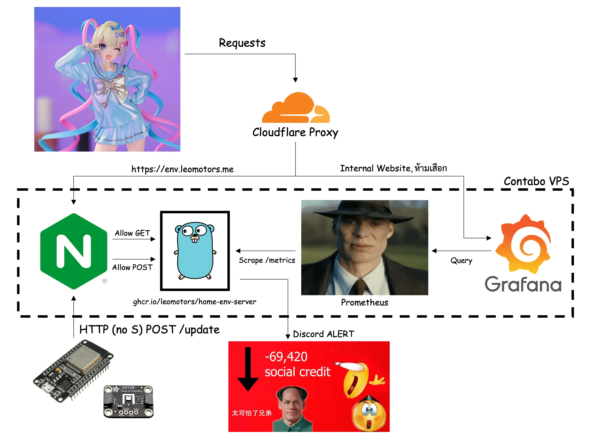
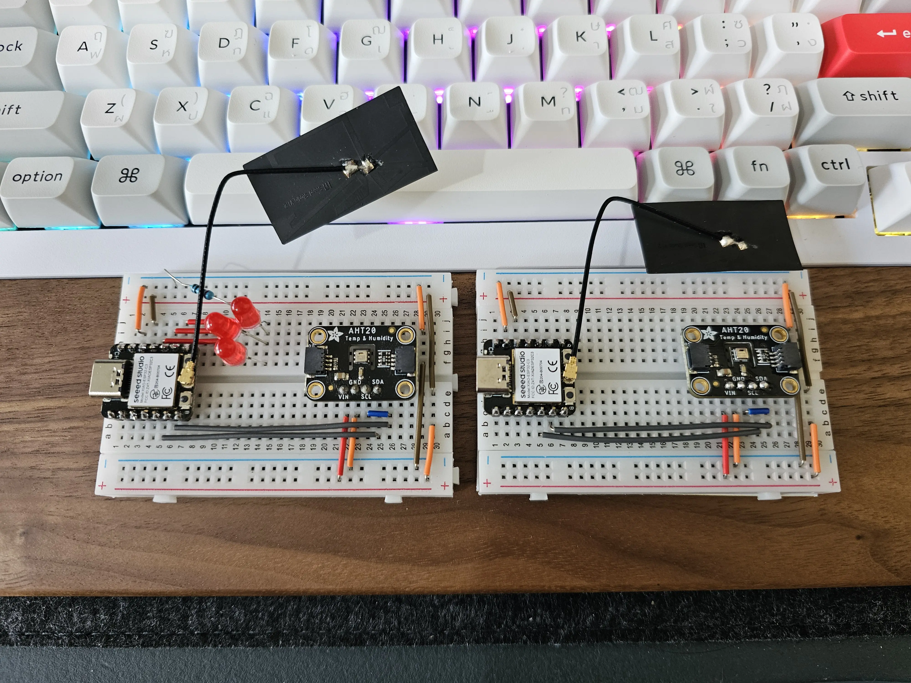
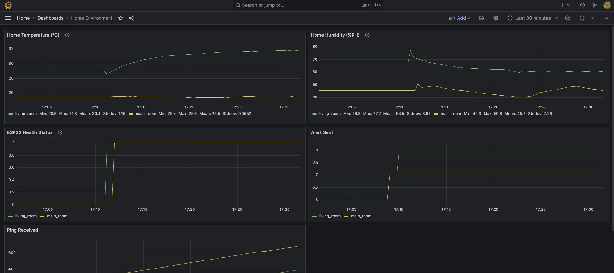
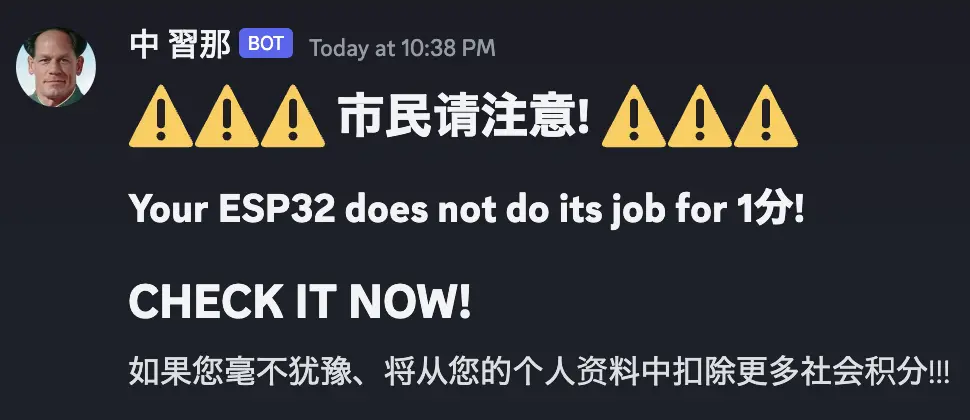
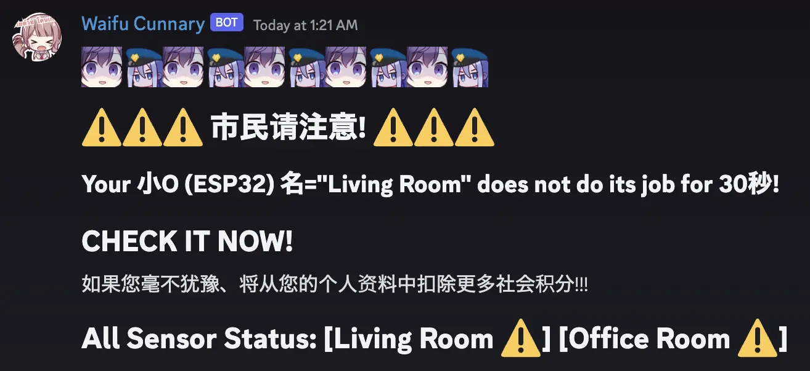
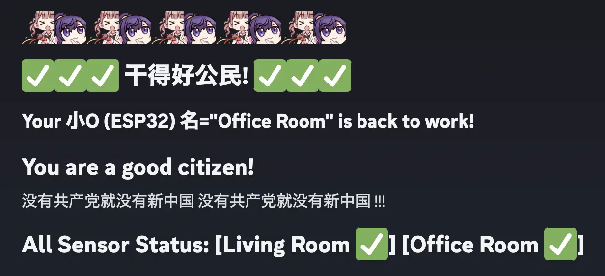

# Home Environment Monitoring System

 

This repository contains a home environment monitoring system that utilizes ESP32 and AHT20 sensors to collect temperature and humidity data. The gathered information is accessible via a web interface and can be integrated with Prometheus for advanced monitoring.

## Features

- Real-time temperature and humidity monitoring
- Web interface for ~~my friend to spy me~~ easy data access
- Prometheus integration for advanced analytics

## Acknowledgments

- Special thanks to [WasinUddy](https://github.com/WasinUddy/Homelab-Environments-Monitor) for hardware recommendations and inspiration (basically ป้ายยา)
- Project Assistance: ChatGPT

## License

This project is licensed under the MIT License - see the [LICENSE](LICENSE) file for details.

## Stack

### On Premise (Current)

### Previous Stack

### Version 2 Hardware

### Grafana Dashboard

## Discord Alert Feature

Alert when ESP32 is not sending data

### Version 1

### Version 2 Canary

### Version 2

